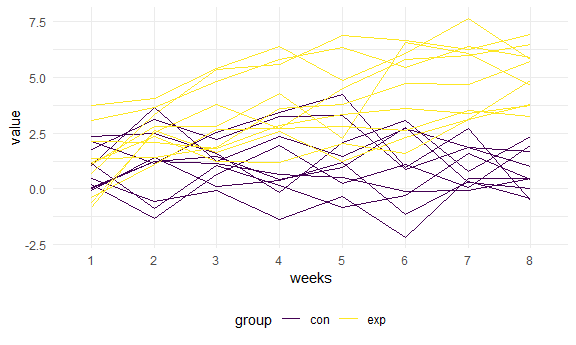

HW5
================
ShibeiXu
2021/11/20

## R Markdown

    ## -- Attaching packages --------------------------------------- tidyverse 1.3.1 --

    ## v ggplot2 3.3.5     v purrr   0.3.4
    ## v tibble  3.1.4     v dplyr   1.0.7
    ## v tidyr   1.1.3     v stringr 1.4.0
    ## v readr   2.0.1     v forcats 0.5.1

    ## -- Conflicts ------------------------------------------ tidyverse_conflicts() --
    ## x dplyr::filter() masks stats::filter()
    ## x dplyr::lag()    masks stats::lag()

## Problem 1

Load the data, create a variable to check for the city and state and
only select resolved status and the city variable

``` r
homicide_df = 
  read_csv("homicide-data.csv") %>% 
  mutate(
    city_state = str_c(city, state, sep = "_"),
    resolved = case_when(
      disposition == "Closed without arrest" ~ "unsolved",
      disposition == "Open/No arrest"        ~ "unsolved",
      disposition == "Closed by arrest"      ~ "solved",
    )
  ) %>% 
  select(city_state, resolved) %>% 
  filter(city_state != "Tulsa_AL")
```

Summarize the total number of homicide cases and the number of unsolved
homicide cases

``` r
aggregate_df = 
  homicide_df %>% 
  group_by(city_state) %>% 
  summarize(
    hom_total = n(),
    hom_unsolved = sum(resolved == "unsolved")
  )
```

Proportion of unsolved case in Baltimore

``` r
prop.test(
  aggregate_df %>% filter(city_state == "Baltimore_MD") %>% pull(hom_unsolved), 
  aggregate_df %>% filter(city_state == "Baltimore_MD") %>% pull(hom_total)) %>% 
  broom::tidy()
```

    ## # A tibble: 1 x 8
    ##   estimate statistic  p.value parameter conf.low conf.high method    alternative
    ##      <dbl>     <dbl>    <dbl>     <int>    <dbl>     <dbl> <chr>     <chr>      
    ## 1    0.646      239. 6.46e-54         1    0.628     0.663 1-sample~ two.sided

Proportion of unsolved case in all cities

``` r
results_df = 
  aggregate_df %>% 
  mutate(
    prop_tests = map2(.x = hom_unsolved, .y = hom_total, ~prop.test(x = .x, n = .y)),
    tidy_tests = map(.x = prop_tests, ~broom::tidy(.x))
  ) %>% 
  select(-prop_tests) %>% 
  unnest(tidy_tests) %>% 
  select(city_state, estimate, conf.low, conf.high)
```

Plot and check for error bar

``` r
results_df %>% 
  mutate(city_state = fct_reorder(city_state, estimate)) %>% 
  ggplot(aes(x = city_state, y = estimate)) +
  geom_point() + 
  geom_errorbar(aes(ymin = conf.low, ymax = conf.high)) + 
  theme(axis.text.x = element_text(angle = 90, vjust = 0.5, hjust = 1))
```


## Problem 2 Use list.file function to check the data

``` r
list.files("data")
```

    ##  [1] "con_01.csv" "con_02.csv" "con_03.csv" "con_04.csv" "con_05.csv"
    ##  [6] "con_06.csv" "con_07.csv" "con_08.csv" "con_09.csv" "con_10.csv"
    ## [11] "exp_01.csv" "exp_02.csv" "exp_03.csv" "exp_04.csv" "exp_05.csv"
    ## [16] "exp_06.csv" "exp_07.csv" "exp_08.csv" "exp_09.csv" "exp_10.csv"

``` r
data_1 = read_csv("data/con_01.csv")
```

In the data tidy and wrangling, first we use map function to read in the
files, then we separate the control and experiment group and rename the
variable. We pivot the variable weeks into longer format so the data is
more understandable.

``` r
export_df = 
  tibble(file_name = list.files("data", pattern = "*"))%>%
  mutate(data = map(.x = str_c("data/", file_name, sep=""), ~ read.csv(.x)))%>%
  separate(file_name, into = c("filename", "post"), sep = "\\.")%>%
  select(-post)%>%
  separate(filename, into = c("group", "id"), sep = "_", remove = F)%>%
  unnest(.)%>%
  pivot_longer(week_1:week_8,names_to = "week",values_to = "value")%>%
  separate(week, into = c("pre", "weeks"), sep = "_") %>% 
  select(-pre)
```

We create a spaghetti plot using variable weeks and value and group by
control and experiment

``` r
export_df %>% 
  ggplot(aes(x = weeks, y = value, group = filename, col = group)) +
  geom_line()
```


## Problem 3 First we load the data check for the missing value in this
dataset

``` r
library(tidyverse)
set.seed(10)
iris_with_missing = iris %>% 
  map_df(~replace(.x, sample(1:150, 20), NA)) %>%
  mutate(Species = as.character(Species))%>%
  janitor::clean_names()
```

Create a function to filling the missing data,we use the if function and
define the replace value when a NA exist

``` r
fill = function(d) {
  if (is.numeric(d)) {
    value_filled = round(mean(d, na.rm = TRUE),2)
    d = d %>% replace_na(value_filled)
  } 
  else if (is.character(d)) {
    d = d %>%replace_na('virginica')
  }
  d
}
```

Use map statement to apply for the missing value

``` r
iris_full=iris_with_missing%>%
mutate(map_df(iris_with_missing,fill))
```

Check the data We use the head function to check if missing value still
exist

``` r
head(iris_full,20)
```

    ## # A tibble: 20 x 5
    ##    sepal_length sepal_width petal_length petal_width species
    ##           <dbl>       <dbl>        <dbl>       <dbl> <chr>  
    ##  1         5.1         3.5          1.4         0.2  setosa 
    ##  2         4.9         3            1.4         0.2  setosa 
    ##  3         4.7         3.2          1.3         0.2  setosa 
    ##  4         4.6         3.1          1.5         1.19 setosa 
    ##  5         5           3.6          1.4         0.2  setosa 
    ##  6         5.4         3.9          1.7         0.4  setosa 
    ##  7         5.82        3.4          1.4         0.3  setosa 
    ##  8         5           3.4          1.5         0.2  setosa 
    ##  9         4.4         2.9          1.4         0.2  setosa 
    ## 10         4.9         3.1          3.77        0.1  setosa 
    ## 11         5.4         3.08         1.5         0.2  setosa 
    ## 12         4.8         3.4          1.6         0.2  setosa 
    ## 13         5.82        3.08         1.4         0.1  setosa 
    ## 14         4.3         3            3.77        0.1  setosa 
    ## 15         5.82        4            3.77        0.2  setosa 
    ## 16         5.7         4.4          1.5         0.4  setosa 
    ## 17         5.4         3.9          1.3         0.4  setosa 
    ## 18         5.1         3.5          1.4         1.19 setosa 
    ## 19         5.7         3.8          1.7         0.3  setosa 
    ## 20         5.1         3.8          1.5         1.19 setosa
